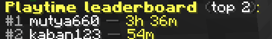

# ChatSync

**Multifunctional chat plugin for Minecraft (Paper 1.21.x – 26.2)**

Global & local chat, private messages, ignore, socialspy, `/me`, chat clear with confirmation, statistics, playtime, announcements, death-message translation, **clickable names** (chat, death, advancements, tops), and full localization (en / ru / de / fr).

[](https://papermc.io/)
[](https://openjdk.org/)

**Modrinth:** [modrinth.com/plugin/chatsync](https://modrinth.com/plugin/chatsync)  
**Repository:** [github.com/Mutya660/ChatSync](https://github.com/Mutya660/ChatSync)

> Color codes used in messages: `&a` `&c` `&7` `&8` `&f` `&e` and `&l` when needed.


<p align="center">
  <a href="https://modrinth.com/plugin/chatsync"></a>
  <a href="https://github.com/Mutya660/ChatSync"></a>
  <a href="https://papermc.io/"></a>
  <a href="https://boosty.to/mutya660"></a>
</p>


**Bug reports / errors:** Discord — [mutya660](https://discord.gg/zQevSujnbe)

---

## English

### Features

| Feature | Description |
| :--- | :--- |
| **Global / local chat** | Prefix `!` → global; otherwise local with radius. Cooldown & slowmode. Bypass: `chatsync.bypass_cooldown`. Clickable names → `/msg`. |
| **Localization** | `en`, `ru`, `de`, `fr` by client locale. Default in config: `language: "en"`. |
| **Death messages** | Optional translation when `language: "ru"` (pack from Minecraft 26.2). Clickable victim/killer names. |
| **Advancements** | Player name in advancement announcements is clickable. Title text comes from the client or a server datapack. |
| **Private messages** | `/msg`, `/reply`, sound, clickable names. |
| **Roleplay** | `/me` with colors (`chatsync.color`). |
| **Clear chat** | `/clear [player]` with clickable confirmation. |
| **Chat stats** | `/chatstats` — top & details; `/chatstats reset`. |
| **Playtime** | `/playtime`, `/playtimetop`, `/lastseen`. |
| **Broadcasts** | `/broadcast` — multi-line layout from `lang/*.yml`, presets, hide author (`-h` / `hide`). |
| **PlaceholderAPI** | `%chatsync_playtime%`, `%chatsync_messages_total%`, etc. |
| **Anti-spam alerts** | Staff with `chatsync.spam.notify` get alerts (repeat, CAPS, flood). |
| **Integrations** | LuckPerms, CoreProtect, PlaceholderAPI, DiscordSRV, LiteBans (soft-depend). |


### Screenshots

| | |
|:---:|:---:|
| **Global / local chat** | **Private message** |
|  |  |
| **Broadcast** | **Broadcast (no author)** |
|  |  |
| **Hover (playtime)** | **Chat stats top** |
|  |  |
| **Playtime** | **Playtime top** |
|  |  |

### Commands & permissions

| Command | Description | Permission |
| :--- | :--- | :--- |
| `/chatsync reload` | Reload config & languages | `chatsync.admin` |
| `/msg <player> <msg>` | Private message | (default true) |
| `/reply <msg>` | Reply to last PM | (default true) |
| `/ignore <player>` | Toggle ignore | (default true) |
| `/ignorelist` | List ignored players | (default true) |
| `/socialspy` | Spy on PMs / local chat | `chatsync.socialspy` |
| `/me <action>` | Roleplay message | `chatsync.me` |
| `/clear [player]` | Clear chat (confirm) | `chatsync.clear` |
| `/chatstats [player\|top]` | Chat statistics | `chatsync.chatstats` |
| `/chatstats reset <player\|all>` | Reset stats (confirm for all) | `chatsync.chatstats.reset` |
| `/playtime [player]` | Playtime | `chatsync.playtime` |
| `/playtimetop` | Playtime leaderboard | `chatsync.playtimetop` |
| `/lastseen <player>` | Last online | `chatsync.lastseen` |
| `/broadcast <msg\|preset>` | Server announcement | `chatsync.broadcast` |
| `/broadcast -h <msg\|preset>` | Announcement without author | `chatsync.broadcast` |
| `/broadcast hide` | Toggle hide-author | `chatsync.broadcast` |
| `/broadcast preset …` | Manage presets in-game | `chatsync.broadcast.preset` |

### Quick setup

1. Put the JAR into `plugins/`.
2. Start the server once, then edit `plugins/ChatSync/config.yml`.
3. `/chatsync reload` after changes.

Key options:

```yaml
language: "en"          # default for console / unknown locales

chat:
  global:
    symbol: "!"
    cooldown: 3
  local:
    radius: 100.0
    cooldown: 2         # local slowmode

death_messages:
  translate: true       # ru pack when language is ru

broadcast:
  show_sender: true
  presets:
    restart_5m: "&c&lServer restarting in 5 minutes!"
    restart_1m: "&c&lServer restarting in 1 minute!"
    maintenance: "&e&lServer is under maintenance. Sorry for the inconvenience."

hover:
  enabled: true
  show_playtime: true

integrations:
  litebans:
    enabled: true
    block_muted: true
```

Announcement **layout** (title lines) is in `lang/en.yml`, `ru.yml`, … under `broadcast.lines` / `lines_hidden` — each language has its own “Announcement from …”.

Player-facing error/help strings are only in `lang/*.yml`, not in `config.yml`.

### Build

Requires **JDK 21+**.

```bash
mvn clean package
# → target/chatsync-1.6.jar
```

Compiled against Paper API **1.21.4** (Java 21). The same JAR runs on Paper **1.21.x through 26.2**.

### Data folder

```
plugins/ChatSync/
├── config.yml
├── lang/          (en, ru, de, fr)
├── death_messages_ru.json
├── entity_names_ru.json
├── stats.yml
├── playtime.yml
└── logs/chat-YYYY-MM-DD.log
```

Advancement **datapacks** (e.g. Russian titles) go in `world/datapacks/`, not inside the plugin JAR.

### Support

<p align="left">
  <a href="https://discord.gg/zQevSujnbe"></a>
</p>

- **Discord:** [discord.gg/zQevSujnbe](https://discord.gg/zQevSujnbe)
- **Boosty:** [boosty.to/mutya660](https://boosty.to/mutya660)
- **GitHub:** [github.com/Mutya660/ChatSync](https://github.com/Mutya660/ChatSync)
- **Modrinth:** [modrinth.com/plugin/chatsync](https://modrinth.com/plugin/chatsync)

Found a bug or error? Write on Discord: [**mutya660**](https://discord.gg/zQevSujnbe)

---

## Русский

**Многофункциональный плагин чата для Minecraft (Paper 1.21.x – 26.2)**

Глобальный и локальный чат, ЛС, игнор, socialspy, `/me`, очистка чата с подтверждением, статистика, playtime, объявления, перевод смертей, **кликабельные ники**, локализация (en / ru / de / fr).

**О баге или ошибке:** Discord — [mutya660](https://discord.gg/zQevSujnbe)

### Возможности

| Возможность | Описание |
| :--- | :--- |
| **Глобальный / локальный чат** | `!` → глобал; иначе локальный с радиусом. Кулдаун и slowmode. Обход: `chatsync.bypass_cooldown`. |
| **Языки** | `en`, `ru`, `de`, `fr` по локали клиента. В конфиге по умолчанию: `language: "en"`. |
| **Смерти** | Перевод при `language: "ru"` (пакет Minecraft 26.2). Кликабельные ники. |
| **Достижения** | Ник в анонсе кликабелен. Текст названия — клиент или датапак сервера. |
| **ЛС** | `/msg`, `/reply`, звук, кликабельные ники. |
| **Ролевой чат** | `/me` (`chatsync.color`). |
| **Очистка** | `/clear [игрок]` с подтверждением. |
| **Статистика** | `/chatstats`, сброс `/chatstats reset`. |
| **Время игры** | `/playtime`, `/playtimetop`, `/lastseen`. |
| **Объявления** | `/broadcast` — оформление из `lang/*.yml`, пресеты, скрытие автора (`-h` / `hide`). |
| **PlaceholderAPI** | `%chatsync_playtime%`, `%chatsync_messages_total%` и др. |
| **Антиспам** | Стаффу с `chatsync.spam.notify`. |
| **Интеграции** | LuckPerms, CoreProtect, PlaceholderAPI, DiscordSRV, LiteBans. |


### Скриншоты

| | |
|:---:|:---:|
| **Глобальный / локальный чат** | **Личное сообщение** |
|  |  |
| **Объявление** | **Объявление без автора** |
|  |  |
| **Hover (playtime)** | **Топ чата** |
|  |  |
| **Время игры** | **Топ playtime** |
|  |  |

### Команды и права

| Команда | Описание | Право |
| :--- | :--- | :--- |
| `/chatsync reload` | Перезагрузка конфига | `chatsync.admin` |
| `/msg` / `/reply` | Личные сообщения | (по умолчанию) |
| `/ignore` / `/ignorelist` | Игнор | (по умолчанию) |
| `/socialspy` | Просмотр ЛС / локала | `chatsync.socialspy` |
| `/me` | Ролевое сообщение | `chatsync.me` |
| `/clear [игрок]` | Очистка чата | `chatsync.clear` |
| `/chatstats` | Статистика | `chatsync.chatstats` |
| `/chatstats reset …` | Сброс статистики | `chatsync.chatstats.reset` |
| `/playtime` / `/playtimetop` / `/lastseen` | Онлайн / топ / last seen | `chatsync.playtime` и др. |
| `/broadcast …` | Объявления, пресеты, `-h`, `hide`, `preset` | `chatsync.broadcast` |

### Быстрая настройка

1. JAR в `plugins/`.
2. Первый запуск → правьте `plugins/ChatSync/config.yml`.
3. После правок: `/chatsync reload`.

Важно:

```yaml
language: "en"

broadcast:
  presets:                 # тексты пресетов — английские по умолчанию
    restart_5m: "&c&lServer restarting in 5 minutes!"
```

**Оформление** объявления («Объявление от …» / «Announcement from …») — в `lang/ru.yml`, `en.yml` и т.д. (`broadcast.lines` / `lines_hidden`).

Тексты ошибок и подсказок — только в `lang/*.yml`.

### Сборка

Нужен **JDK 21+**.

```bash
mvn clean package
# → target/chatsync-1.6.jar
```

Сборка против Paper API **1.21.4**. Тот же JAR работает на **1.21.x – 26.2**.

### Поддержка

<p align="left">
  <a href="https://discord.gg/zQevSujnbe"></a>
</p>

- **Discord:** [discord.gg/zQevSujnbe](https://discord.gg/zQevSujnbe)
- **Boosty:** [boosty.to/mutya660](https://boosty.to/mutya660)
- **GitHub:** [github.com/Mutya660/ChatSync](https://github.com/Mutya660/ChatSync)
- **Modrinth:** [modrinth.com/plugin/chatsync](https://modrinth.com/plugin/chatsync)

Нашли баг или ошибку? Напишите в Discord: [**mutya660**](https://discord.gg/zQevSujnbe)

---

*ChatSync v1.6 · [github.com/Mutya660/ChatSync](https://github.com/Mutya660/ChatSync)*

---

<sub>This plugin was developed with the help of AI. / Плагин сделан с помощью ИИ.</sub>
