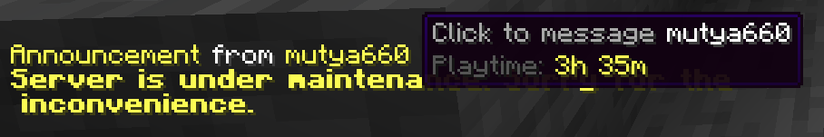
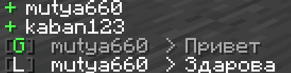
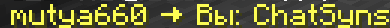
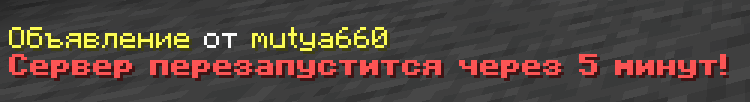
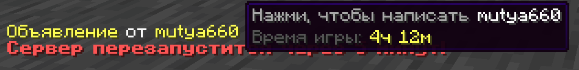

# ChatSync

**Multifunctional chat plugin for Minecraft (Paper 1.21.x – 26.2)** · **v1.7.1**

Global & local chat, private messages, ignore, socialspy, `/me`, clear chat, statistics, playtime, broadcasts, teams, death-message translation, clickable names, player heads, vanish-aware join/quit, full localization (**en / ru / de / fr**).

<p align="center">
  <a href="https://modrinth.com/plugin/chatsync"></a>
  <a href="https://www.spigotmc.org/resources/chatsync.137778/"></a>
  <a href="https://www.curseforge.com/minecraft/bukkit-plugins/chatsync"></a>
</p>
<p align="center">
  <a href="https://discord.com/invite/zQevSujnbe"></a>
  <a href="https://boosty.to/mutya660/donate"></a>
  <a href="https://github.com/Mutya660/ChatSync"></a>
</p>

---

## English

### Features

| Feature | Description |
| :--- | :--- |
| **Global / local chat** | Prefix `!` → global; otherwise local with radius. Cooldown & slowmode. Clickable names. `{username-color}`, `%head%` (optional heads), message color via code before `%message%`. |
| **Localization** | `en`, `ru`, `de`, `fr`. `auto_language: true` follows the client language. |
| **Death messages** | Optional RU pack (Minecraft 26.2). Clickable names. |
| **Private messages** | `/msg`, `/reply`. |
| **Roleplay** | `/me`. |
| **Clear chat** | `/clear` with confirmation. |
| **Chat stats** | `/chatstats`, reset. |
| **Playtime** | `/playtime`, `/playtimetop`, `/lastseen`. |
| **Broadcasts** | `/broadcast`, presets, hide author. |
| **Vanish** | Hide join/quit when vanished. |
| **Anti-spam** | Staff alerts. |
| **Integrations** | LuckPerms, CoreProtect, PlaceholderAPI, DiscordSRV, LiteBans, SuperVanish / PremiumVanish / Essentials. |

### Screenshots

<p align="center">
  
  
  
  
</p>

### Commands

| Command | Description | Permission |
| :--- | :--- | :--- |
| `/chatsync reload` | Reload config & languages | `chatsync.admin` |
| `/msg <player> <text>` | Private message | *(default true)* |
| `/reply <text>` | Reply to last PM | *(default true)* |
| `/ignore <player>` | Toggle ignore | *(default true)* |
| `/ignorelist` | List ignored players | *(default true)* |
| `/socialspy` | Spy on PMs / local chat | `chatsync.spy` |
| `/me <action>` | Roleplay message | `chatsync.me` |
| `/clear [player]` | Clear chat (confirm) | `chatsync.clear` |
| `/chatstats [player\|top]` | Chat statistics | `chatsync.chatstats` |
| `/chatstats reset <player\|all>` | Reset stats | `chatsync.chatstats.reset` |
| `/playtime [player]` | Playtime | `chatsync.playtime` |
| `/playtimetop` | Playtime leaderboard | `chatsync.playtimetop` |
| `/lastseen <player>` | Last online | `chatsync.lastseen` |
| `/broadcast <msg\|preset>` | Announcement | `chatsync.broadcast` |
| `/broadcast -h` / `hide` | Announcement without author | `chatsync.broadcast` |
| `/broadcast preset …` | Manage presets | `chatsync.broadcast.preset` |

#### Team commands (`/team`, aliases: `/party`, `/squad`)

A player can be in **only one team** at a time. To join another team, leave the current one first.

Each team has its **own chat symbol** (e.g. `#`, `$`, `~`). Only members can write with that symbol.

| Command | Description | Who |
| :--- | :--- | :--- |
| `/team create <name>` | Create a team (auto chat symbol) | `chatsync.team.create` |
| `/team invite <player>` | Invite (clickable Accept / Deny) | owner / co-owner |
| `/team accept` / `deny` | Accept or deny invite | invited player |
| `/team leave` | Leave the team | member |
| `/team kick <player>` | Kick a member | owner / co-owner |
| `/team disband` | Delete the team | owner |
| `/team chat <text>` | Message to your team | member |
| `#text` (or your team’s symbol) | Same as `/team chat` | member |
| `/team name <new>` | Rename | owner / co-owner |
| `/team color <code>` | Color (`&c`, `&c&l`, …) | owner / co-owner |
| `/team symbol <char>` | Unique chat prefix | owner / co-owner |
| `/team info` | Info (`*` owner, `+` co-owner) | member |
| `/team transfer <player>` | Transfer ownership | owner |
| `/team promote <player>` | Add co-owner | owner |
| `/team demote <player>` | Remove co-owner | owner |

### Permissions

| Permission | Default | Description |
| :--- | :--- | :--- |
| `chatsync.admin` | op | Reload |
| `chatsync.bypass_cooldown` | op | Bypass chat cooldown |
| `chatsync.spy` | op | Socialspy |
| `chatsync.color` | op | `&` colors in chat |
| `chatsync.me` | true | `/me` |
| `chatsync.clear` | op | `/clear` |
| `chatsync.chatstats` | true | View stats |
| `chatsync.chatstats.others` | op | Other players’ stats |
| `chatsync.chatstats.reset` | op | Reset stats |
| `chatsync.broadcast` | op | Broadcast |
| `chatsync.broadcast.preset` | op | Presets |
| `chatsync.playtime` | true | Playtime |
| `chatsync.playtimetop` | true | Leaderboard |
| `chatsync.lastseen` | true | Last seen |
| `chatsync.spam.notify` | op | Spam alerts |
| `chatsync.spam.bypass` | op | Bypass spam check |
| `chatsync.team` | true | Use `/team` |
| `chatsync.team.create` | true | Create a team |
| `chatsync.team.admin` | op | Admin bypass |

### PlaceholderAPI

| Placeholder | Description |
| :--- | :--- |
| `%chatsync_playtime%` | Formatted playtime |
| `%chatsync_playtime_seconds%` | Seconds |
| `%chatsync_messages_total%` | Total messages |
| `%chatsync_messages_global%` | Global |
| `%chatsync_messages_local%` | Local |
| `%chatsync_messages_pm%` | PMs |
| `%chatsync_messages_me%` | `/me` |
| `%chatsync_messages_broadcast%` | Broadcasts |
| `%chatsync_team%` | Team name |
| `%chatsync_team_symbol%` | Chat symbol (`#`, `$`, …) |
| `%chatsync_team_color%` | Color codes |
| `%chatsync_team_owner%` | Owner name |
| `%chatsync_team_size%` | Members count |
| `%chatsync_team_members%` | Member list |
| `%chatsync_in_team%` | `yes` / `no` |
| `%chatsync_team_is_owner%` | `yes` / `no` |
| `%chatsync_team_is_leader%` | Owner or co-owner |

### Quick setup

```yaml
language: "en"
auto_language: true

chat:
  username_color: "&7"     # {username-color} in formats
  heads:
    enabled: false         # true = show %head% (Paper)
    fallback: ""
  global:
    format: "&8[&aG&8] %head%%luckperms_prefix% {username-color}%player%&7 > &f%message%"

vanish:
  hide_join_quit: true

teams:
  enabled: true
  max_members: 8
  max_co_owners: 3
  default_symbol: "#"
  symbol_pool: "#$~@%^*"
  format: "&8[%color%%team%&8] &f%player%&7: &f%message%"
```

### Build

**JDK 21+** · `mvn clean package` → `target/chatsync-1.7.1.jar` · Paper **1.21.x – 26.2**

### Support

Discord: [discord.com/invite/zQevSujnbe](https://discord.com/invite/zQevSujnbe)

---

## Русский

### Возможности

| Возможность | Описание |
| :--- | :--- |
| **Глобальный / локальный чат** | `!` → глобал; иначе локал. `{username-color}`, `%head%` (головы), цвет текста — код перед `%message%`. |
| **Локализация** | `en`, `ru`, `de`, `fr`. `auto_language: true` — язык как в настройках клиента. |
| **Сообщения о смерти** | Опциональный RU-пакет (ключи Minecraft 26.2). Кликабельные ники. |
| **Достижения** | Кликабельный ник в анонсе. |
| **Личные сообщения** | `/msg`, `/reply`. |
| **Ролевой чат** | `/me`. |
| **Очистка чата** | `/clear` с подтверждением. |
| **Статистика чата** | `/chatstats`, сброс. |
| **Время игры** | `/playtime`, `/playtimetop`, `/lastseen`. |
| **Объявления** | `/broadcast`, пресеты, скрытие автора. |
| **Ваниш** | Без сообщений входа/выхода в ванише. |
| **Антиспам** | Алерты стаффу. |
| **Интеграции** | LuckPerms, CoreProtect, PlaceholderAPI, DiscordSRV, LiteBans, SuperVanish / PremiumVanish / Essentials. |

### Скриншоты

<p align="center">
  
  
  
  
</p>

### Команды

| Команда | Описание | Право |
| :--- | :--- | :--- |
| `/chatsync reload` | Перезагрузка конфига и языков | `chatsync.admin` |
| `/msg <игрок> <текст>` | Личное сообщение | *(по умолчанию)* |
| `/reply <текст>` | Ответ на последнее ЛС | *(по умолчанию)* |
| `/ignore <игрок>` | Игнор вкл/выкл | *(по умолчанию)* |
| `/ignorelist` | Список игнора | *(по умолчанию)* |
| `/socialspy` | Просмотр ЛС / локала | `chatsync.spy` |
| `/me <действие>` | Ролевое сообщение | `chatsync.me` |
| `/clear [игрок]` | Очистка чата (с подтверждением) | `chatsync.clear` |
| `/chatstats [игрок\|top]` | Статистика чата | `chatsync.chatstats` |
| `/chatstats reset <игрок\|all>` | Сброс статистики | `chatsync.chatstats.reset` |
| `/playtime [игрок]` | Время игры | `chatsync.playtime` |
| `/playtimetop` | Топ по времени игры | `chatsync.playtimetop` |
| `/lastseen <игрок>` | Когда был онлайн | `chatsync.lastseen` |
| `/broadcast <текст\|пресет>` | Объявление | `chatsync.broadcast` |
| `/broadcast -h` / `hide` | Объявление без автора | `chatsync.broadcast` |
| `/broadcast preset …` | Управление пресетами | `chatsync.broadcast.preset` |

#### Команды `/team` (алиасы: `/party`, `/squad`)

Игрок может состоять **только в одной команде**. Чтобы вступить в другую — сначала `/team leave`.

У каждой команды свой **символ чата** (например `#`, `$`, `~`). Писать этим символом могут только участники этой команды.

| Команда | Описание | Кто |
| :--- | :--- | :--- |
| `/team create <имя>` | Создать команду (символ чата выдаётся автоматически) | `chatsync.team.create` |
| `/team invite <игрок>` | Пригласить (кликабельные **Принять** / **Отклонить**) | владелец / совладелец |
| `/team accept` / `deny` | Принять или отклонить приглашение | приглашённый |
| `/team leave` | Выйти из команды | участник |
| `/team kick <игрок>` | Исключить участника | владелец / совладелец |
| `/team disband` | Распустить команду | владелец |
| `/team chat <текст>` | Сообщение в чат своей команды | участник |
| `#текст` (или символ вашей команды) | То же, что `/team chat` | участник |
| `/team name <новое>` | Переименовать | владелец / совладелец |
| `/team color <код>` | Цвет (`&c`, `&c&l` и т.д.) | владелец / совладелец |
| `/team symbol <символ>` | Уникальный префикс чата | владелец / совладелец |
| `/team info` | Информация (`*` владелец, `+` совладелец) | участник |
| `/team transfer <игрок>` | Передать владение | владелец |
| `/team promote <игрок>` | Назначить совладельца | владелец |
| `/team demote <игрок>` | Снять совладельца | владелец |

### Права

| Право | По умолчанию | Описание |
| :--- | :--- | :--- |
| `chatsync.admin` | op | Перезагрузка |
| `chatsync.bypass_cooldown` | op | Обход кулдауна чата |
| `chatsync.spy` | op | Socialspy |
| `chatsync.color` | op | Цвета `&` в чате |
| `chatsync.me` | true | `/me` |
| `chatsync.clear` | op | `/clear` |
| `chatsync.chatstats` | true | Просмотр статистики |
| `chatsync.chatstats.others` | op | Статистика других |
| `chatsync.chatstats.reset` | op | Сброс статистики |
| `chatsync.broadcast` | op | Объявления |
| `chatsync.broadcast.preset` | op | Пресеты |
| `chatsync.playtime` | true | Время игры |
| `chatsync.playtimetop` | true | Топ playtime |
| `chatsync.lastseen` | true | Last seen |
| `chatsync.spam.notify` | op | Алерты о спаме |
| `chatsync.spam.bypass` | op | Обход антиспама |
| `chatsync.team` | true | Использование `/team` |
| `chatsync.team.create` | true | Создание команды |
| `chatsync.team.admin` | op | Админский обход |

### PlaceholderAPI

| Плейсхолдер | Описание |
| :--- | :--- |
| `%chatsync_playtime%` | Время игры (форматированное) |
| `%chatsync_playtime_seconds%` | Секунды |
| `%chatsync_messages_total%` | Всего сообщений |
| `%chatsync_messages_global%` | Глобальный чат |
| `%chatsync_messages_local%` | Локальный чат |
| `%chatsync_messages_pm%` | Личные сообщения |
| `%chatsync_messages_me%` | `/me` |
| `%chatsync_messages_broadcast%` | Объявления |
| `%chatsync_team%` | Название команды |
| `%chatsync_team_symbol%` | Символ чата (`#`, `$`, …) |
| `%chatsync_team_color%` | Цветовые коды |
| `%chatsync_team_owner%` | Ник владельца |
| `%chatsync_team_size%` | Число участников |
| `%chatsync_team_members%` | Список участников |
| `%chatsync_in_team%` | `yes` / `no` |
| `%chatsync_team_is_owner%` | `yes` / `no` |
| `%chatsync_team_is_leader%` | Владелец или совладелец |

### Быстрая настройка

```yaml
language: "en"
auto_language: true

chat:
  heads:
    enabled: true
    force_first: true
    gap: " "
  global:
    format: "%head%&8[&aG&8] %luckperms_prefix% {username-color}%player% %luckperms_suffix%&7 » &f%message%"
  local:
    format: "%head%&8[&fL&8] %luckperms_prefix% {username-color}%player% %luckperms_suffix%&7 » &f%message%"

vanish:
  hide_join_quit: true

teams:
  enabled: true
  max_members: 8
  max_co_owners: 3
  default_symbol: "#"
  symbol_pool: "#$~@%^*"
```

### Сборка

Нужен **JDK 21+**.

```bash
mvn clean package
# → target/chatsync-1.7.1.jar
```

Сборка против Paper API **1.21.4**. Тот же JAR работает на **1.21.x – 26.2**.

### Поддержка

Нашли баг или ошибку? Discord: [discord.com/invite/zQevSujnbe](https://discord.com/invite/zQevSujnbe)

---


### Links / Ссылки

| | |
| :--- | :--- |
| **GitHub** | https://github.com/Mutya660/ChatSync |
| **Modrinth** | https://modrinth.com/plugin/chatsync |
| **SpigotMC** | https://www.spigotmc.org/resources/chatsync.137778/ |
| **CurseForge** | https://www.curseforge.com/minecraft/bukkit-plugins/chatsync |
| **Discord** | https://discord.com/invite/zQevSujnbe |
| **Boosty** | https://boosty.to/mutya660/donate |


*ChatSync v1.7.1*

<sub>This plugin was developed with the help of AI. / Плагин сделан с помощью ИИ.</sub>
